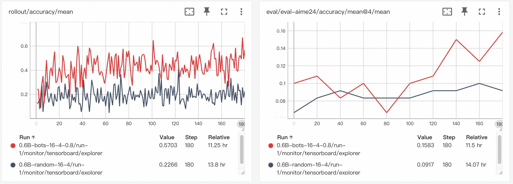

# [WIP] Training Math Agent with Data-Augment Strategies

This example demonstrates how to use **AgentScope-Tuner** to enhance a math problem-solving agent task. We will focus on leveraging **Data-Centric** features, such as the `difficulty_based` task selector, to improve data utility training efficiency.

## Task Setting

We use the foundational [math-agent example](../react_agent/main.py) as our baseline to demonstrate the data enhancement capabilities. Notably, these data-centric techniques are generic and customizable, making them adaptable to other agent workflows.

### Agent Goal and Type
The agent's objective is to solve mathematical reasoning problems, learning to produce a correct final answer through a step-by-step thought process. The agent is implemented as a **`ReActAgent`**, which follows a reasoning-acting loop to solve tasks iteratively.

### Environment
Each task is a question-answer pair from a math dataset. The agent's performance is evaluated based on its final answer.

### Objective of the Data-Centric Approach

Training can be inefficient if tasks are too easy or too hard. This example addresses this by providing **selector** to dynamically select tasks using **data feedback**, which empowers users to explore and implement their own data-centric strategies, such as focusing on "productively challenging" samples, to maximize training efficiency.

## Dataset Preparation

To enable difficulty-based sampling, our training data needs to include features that represent the "difficulty" of each task.

1.  **Base Dataset**: You can use any standard math problem dataset. A good example is math data in [LLM360/guru-RL-92k](https://huggingface.co/datasets/LLM360/guru-RL-92k), which comes pre-annotated with pass rates from different LLMs, serving as direct difficulty features.
2.  **Build Your Own Features**: If you use your own dataset, you can generate these features by pre-running several models of varying capabilities and recording their pass rates (can be done in [Trinity](https://github.com/modelscope/Trinity-RFT/pull/440)). 
3.  **Data Format**: The final dataset should be in HuggingFace format. In this example, data will be transfered to *GSM8K format* according to the [workflow](../react_agent/main.py). Besides the task content, it should include the difficulty feature columns you've defined (e.g., `qwen_7b_pass_rate`, `qwen_30b_pass_rate`).
4. **Example data preparation**: We provide the data preparation script of this example, you can execute the script `python prepare_data.py`.

## Code Implementation

### Agent Workflow & Judge Function

This example follows the foundational [math-agent example](../react_agent/main.py), adopting its `run_react_agent` and `gsm8k_judge` as the agent workflow and judge function, respectively. For implementation details, please refer to the explanations and code in that example.

### Data-Centric Features

Leveraging the powerful data processing capabilities of **`Trinity`**, **AgentScope-Tuner** provides interfaces for advanced operations such as data preprocessing, task selection strategies, and experience filtering. We introduce two core features below.

#### Task Selector

The `Task Selector` determines how samples are selected from a dataset. **AgentScope-Tuner** supports various built-in selectors, which can be easily configured in Python.

- **Built-in Selectors**:
  - `sequential`: Samples are selected in a fixed order.
  - `shuffle`: The dataset is shuffled at the beginning of each epoch.
  - `random`: Samples are randomly chosen with replacement for each batch.
  - `offline_easy2hard`: Samples are sorted by a predefined feature for curriculum learning.
  - `difficulty_based` (Custom): An adaptive sampler based on task difficulty.

> For more details on `Task Selector`, including how to implement a custom selector based on feedback signals, please refer to Trinity's **[Selector Development Guide](https://github.com/modelscope/Trinity-RFT/blob/main/docs/sphinx_doc/source/tutorial/develop_selector.md)**.

#### Data Processor

The `Data Processor` allows for real-time processing of **Task** and **Experience** during training, enabling operations like calculating feedback metrics, data augmentation, or filtering.

For example, the ***difficulty_based*** selector requires a ***pass_rate_calculator*** operator to compute the average reward for each task in real time. This feedback is then used to update the selector's internal difficulty model.

> For more details on `Data Processor`, please refer to Trinity's **[Operator Development Guide](https://github.com/modelscope/Trinity-RFT/blob/main/docs/sphinx_doc/source/tutorial/develop_operator.md)**.


## How to Run


### Data-Centric Configuration in Python

All data-related configurations, such as task selectors and evaluation setups, can be managed cleanly via the `Dataset` object. Detailed hyper-parameters configuration can be found in [BOTS](https://github.com/modelscope/Trinity-RFT/blob/main/examples/bots/README.md).

```python
# Baseline: random selector
train_dataset = Dataset(
    path="path/to/your/augmented/math_data",
    split="train",
    task_selector={'selector_type': 'random'},
)

# Difficulty-based selector
train_dataset = Dataset(
    path="path/to/your/augmented/math_data",
    split="train",
    task_selector={
        'selector_type': 'difficulty_based',
        'feature_keys': ["qwen_7b_pass_rate", "qwen_30b_pass_rate"],
        'kwargs': {...},
    },
)

# (Optional) Evaluation setup
eval_sets = Dataset(path="path/to/aime_eval_data")
```

For global, static configurations like `data_processor`, we recommend loading a base YAML file via `config_path`.

```yaml
# file: config.yaml

# Enable the pass_rate_calculator to provide feedback for the difficulty_based selector
data_processor:
  experience_pipeline:
    operators:
      - name: pass_rate_calculator
...
```

### Startup Command

Finally, use `tune()` to train the workflow.

```python
if __name__ == "__main__":
    config_path = "path/to/config.yaml"
    train_dataset = Dataset(...)
    eval_sets = [Dataset(...), Dataset(...)]

    tune(
        workflow_func=run_react_agent,
        judge_func=gsm8k_judge,
        config_path=config_path,
        train_dataset=train_dataset,
        eval_datasets=eval_sets,
    )
```

## Experimental Results 

The following results compare the performance of the `difficulty-based` selection strategy (red line, bots) against a standard `random` selection strategy (black line, random).



### Training Reward Curve

The chart on the left shows the rollout accuracy during training. As can be seen, the tasks sampled by the random strategy appear to be difficult for the model, with the accuracy remaining below 0.2. In contrast, using the difficulty selector results in a higher mean accuracy, indicating that the agent is engaging with more tasks that it can successfully solve.

### Evaluation on AIME-24

For comparison, we evaluated both selection strategies on the AIME-24 benchmark. The chart on the right shows that the difficulty-based method demonstrates a better upward trend in performance over time.
